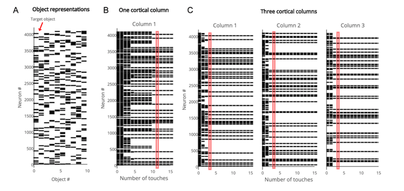
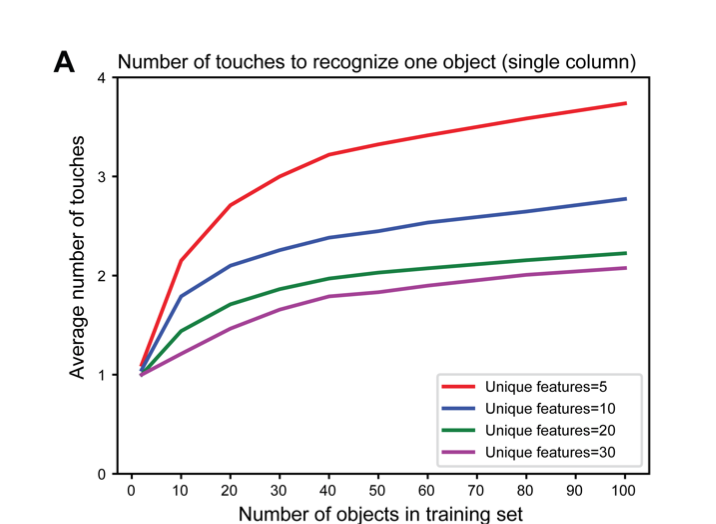
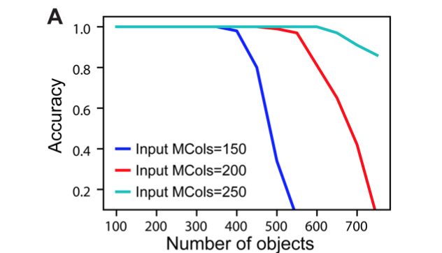
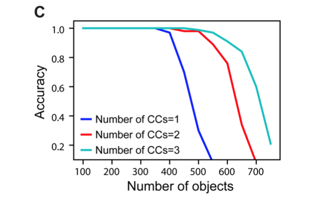

This directory contains Python scripts used to generate the figures and results presented in ([Hawkins et al., 2017][1]).

Installing HTM Research Library
-------------------------------

All the scripts in this directory depends on Numenta's [HTM Research library][2].
This library requires [python 2.7][3] to be installed and avaialble on Windows, Linux and OSX plaforms.

To install [HTM Research library][2] and its dependencies, use the following command:

```
pip install -r requirements.txt
```

Generating figures
------------------

Use the [generate_figure.py](generate_figure.py) script to run the experiments and generate the figures presented in the paper: 

```
usage: generate_figure.py [-h] [-c NUM] [-l] [FIGURE]

positional arguments:
  FIGURE                Specify the figure name to generate. Possible values
                        are: ['4', '5A', '5B', '6A', '6B', '6C']

optional arguments:
  -h, --help            show this help message and exit
  -c NUM, --cpuCount NUM
                        Limit number of cpu cores. Defaults to all available
                        cores
  -l, --list            List all figures

```

For example to run the convergence experiment presented in "*Figure 5A*" run the following command:

```
python generate_figure.py 5A
```

-------------------------------------------------------------------------------

### Figure 4: Rate of convergence for a one column network and for a three-column network



**Figure 4A**: The output layer represents each object by a sparse pattern. We tested the network on the first object.  **Figure 4B**: Activity in the output layer of a single column network as it touches the object. The network converges after 11 touches (red rectangle). **Figure 4C**: Activity in the output layer of a three column network as it touches the object. The network converges much faster, after 4 touches (red rectangle). In both B and C the representation in Column 1 is the same as the target object representation after convergence 

-------------------------------------------------------------------------------
### Figure 5: Mean number of observations to unambiguously recognize an object



**Figure 5A**: Mean number of observations to unambiguously recognize an object with a single column network as the set of learned objects increases. We train models on varying numbers of objects, from 1 to 100 and plot the average number of touches required to unambiguously recognize a single object. The different curves show how convergence varies with the total number of unique features from which objects are constructed. In all cases the network is able to eventually recognize the object, but the recognition is much faster when the set of features is greater.

-------------------------------------------------------------------------------


**Figure 5B**: Mean number of observations to unambiguously recognize an object with multi-column networks as the set of learned objects increases. We train each network with 100 objects and plot the average number of touches required to unambiguously recognize an object. Recognition time improves rapidly as the number of columns increases.

-------------------------------------------------------------------------------
### Figure 6. Retrieval accuracy is plotted as a function of the number of learned objects.

 

**Figure 6A**: Network capacity relative to number of minicolumns in the input layer. The number of output cells is kept at 4096 with 40 cells active at any time.

-------------------------------------------------------------------------------
 

**Figure 6B**: Network capacity relative to number of cells in the output layer. The number of active output cells is kept  at 40. The number of minicolumns in the input layer is 150.

-------------------------------------------------------------------------------


**Figure 6C**: Network capacity for one, two, and three cortical columns (CCs). The number of minicolumns in the input layer is 150, and the number of output cells is 4096. 

-------------------------------------------------------------------------------
* Jeff Hawkins, Subutai Ahmad, Yuwei Cui (2017)  Why Does the Neocortex Have Layers and Columns, a Theory of Learning the 
3D Structure of the World, Preprint of journal submission. doi: 10.1101/162263.<br>
http://www.biorxiv.org/content/early/2017/07/12/162263


[1]: http://www.biorxiv.org/content/early/2017/07/12/162263
[2]: https://github.com/numenta/htmresearch
[3]: https://www.python.org/downloads
