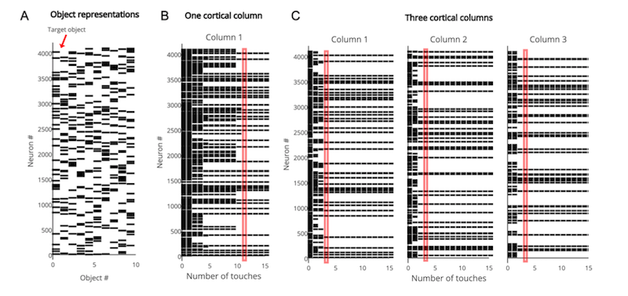
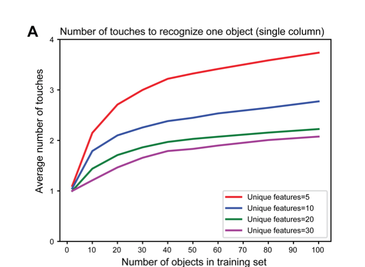
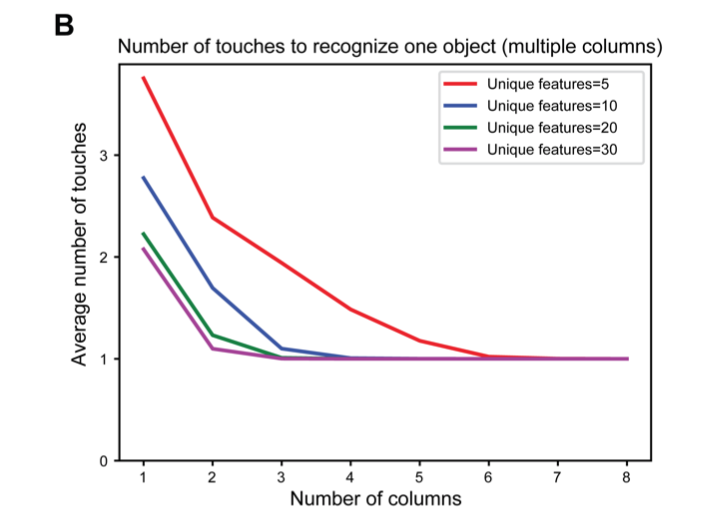
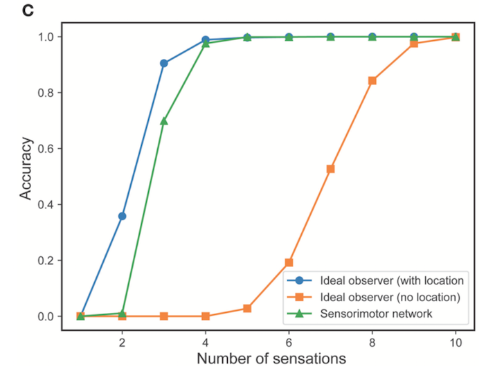
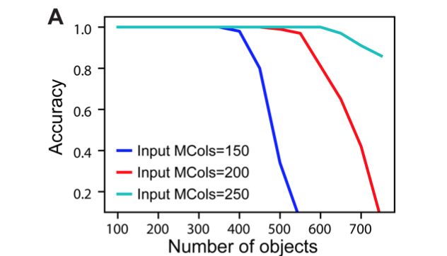
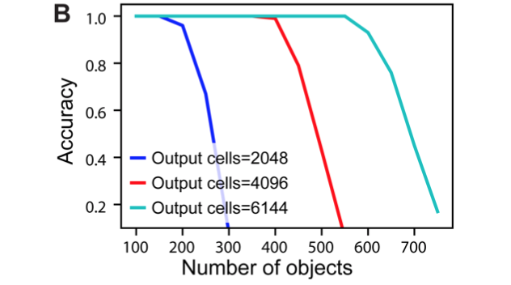
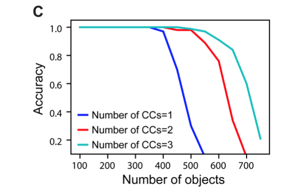
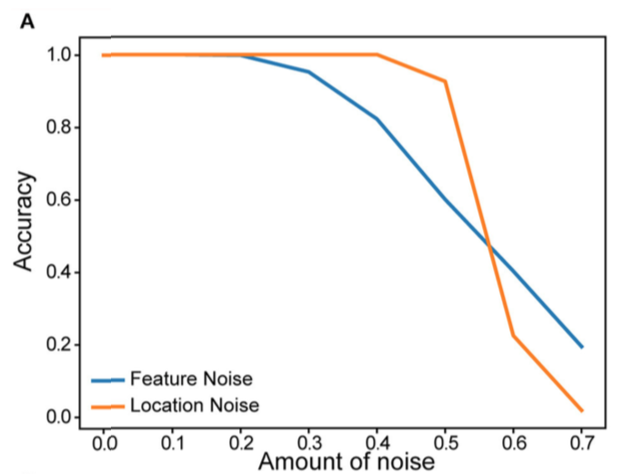
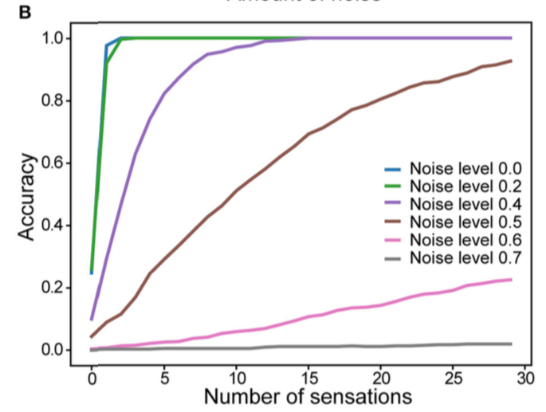

# A Theory of How Columns in the Neocortex Enable Learning the Structure of the World, Frontiers in Neural Circuits 11, 81.<br>[doi:10.3389/FNCIR.2017.00081][1]

Installing HTM Research Library
-------------------------------

All the scripts in this directory depends on Numenta's [HTM Research library][2].
This library requires [python 2.7][3] to be installed and avaialble on Windows, Linux and OSX plaforms.

To install [HTM Research library][2] and its dependencies, use the following command:

```
pip install -r requirements.txt
```

Generating figures
------------------

Use the [generate_figure.py](generate_figure.py) script to run the experiments and generate the figures presented in the paper: 

```
usage: generate_figure.py [-h] [-c NUM] [-l] [FIGURE]

positional arguments:
  FIGURE                Specify the figure name to generate. Possible values
                        are: ['3', '4A', '4B', '4C', '5A', '5B', '5C', '6A',
                        '6B']

optional arguments:
  -h, --help            show this help message and exit
  -c NUM, --cpuCount NUM
                        Limit number of cpu cores. Defaults to all available
                        cores
  -l, --list            List all figures

```

For example to run the convergence experiment presented in "*Figure 4A*" run the following command:

```
python generate_figure.py 4A
```

-------------------------------------------------------------------------------

### Figure 3: Rate of convergence for a one column network and for a three-column network



**Figure 3**: (A) The output layer represents each object by a sparse pattern. We tested the network on the first object. (B) Activity in the output layer of a single column network as it touches the object. The network converges after 11 sensations (red rectangle). (C) Activity in the output layer of a three column network as it touches the object. The network converges much faster, after four sensations (red rectangle). In both (B,C) the representation in Column 1 is the same as the target object representation after convergence

-------------------------------------------------------------------------------
### Figure 4: Mean number of observations to unambiguously recognize an object



**Figure 4A**: Mean number of sensations needed to unambiguously recognize an object with a single column network as the set of learned objects increases. We train models on varying numbers of objects, from 1 to 100 and plot the average number of sensations required to unambiguously recognize a single object. The different curves show how convergence varies with the total number of unique features from which objects are constructed. In all cases the network eventually recognizes the object. Recognition requires fewer sensations when the set of features is greater


-------------------------------------------------------------------------------


**Figure 4B**: Mean number of observations needed to unambiguously recognize an object with multi-column networks as the set of columns increases. We train each network with 100 objects and plot the average number of sensations required to unambiguously recognize an object. The required number of sensations rapidly decreases as the number of columns increases, eventually reaching one


-------------------------------------------------------------------------------


**Figure 4C**: Fraction of objects that can be unambiguously recognized as a function of number of sensations for an ideal observer model with location (blue), without location (orange) and our one-column sensorimotor network (green).


-------------------------------------------------------------------------------
### Figure 5. Recognition accuracy is plotted as a function of the number of learned objects.

 

**Figure 5A**: Network capacity relative to number of mini-columns in the input layer. The number of output cells is kept at 4,096 with 40 cells active at any time.

-------------------------------------------------------------------------------
 

**Figure 5B**: Network capacity relative to number of cells in the output layer. The number of active output cells is kept at 40. The number of mini-columns in the input layer is 150.

-------------------------------------------------------------------------------


**Figure 5C**: Network capacity for one, two, and three cortical columns (CCs). The number of mini-columns in the input layer is 150, and the number of output cells is 4,096. 

-------------------------------------------------------------------------------
### Figure 6. Robustness of a single column network to noise

 

**Figure 6A**: Recognition accuracy is plotted as a function of the amount of noise in the sensory input (blue) and in the location input (yellow).

-------------------------------------------------------------------------------
 

**Figure 6B**: Recognition accuracy as a function of the number of sensations. Colored lines correspond to noise levels in the location input

-------------------------------------------------------------------------------

[1]: https://doi.org/10.3389/fncir.2017.00081
[2]: https://github.com/numenta/htmresearch
[3]: https://www.python.org/downloads
