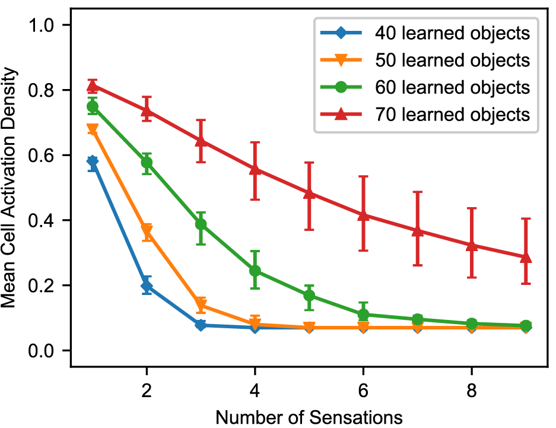
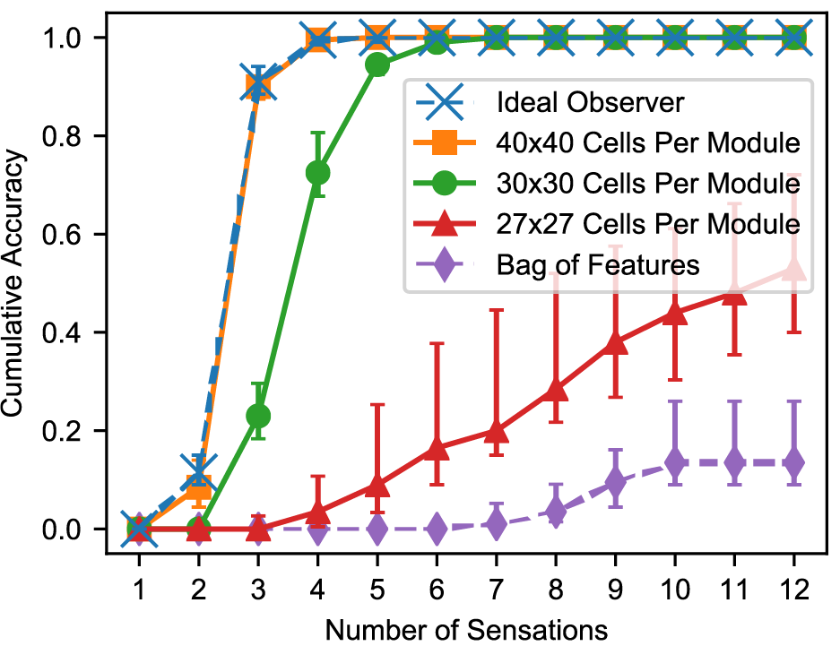
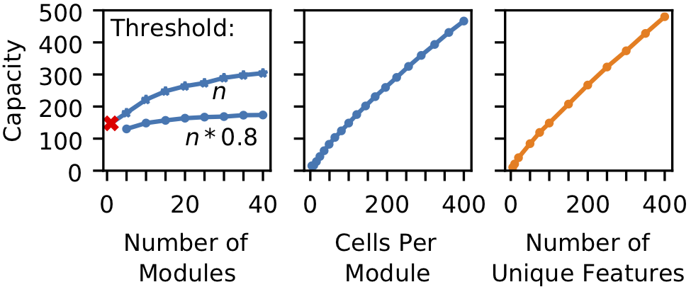
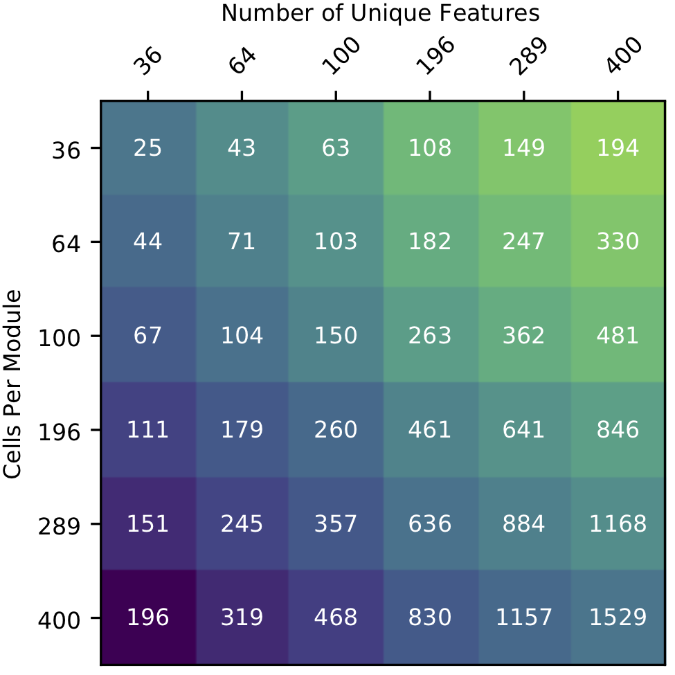
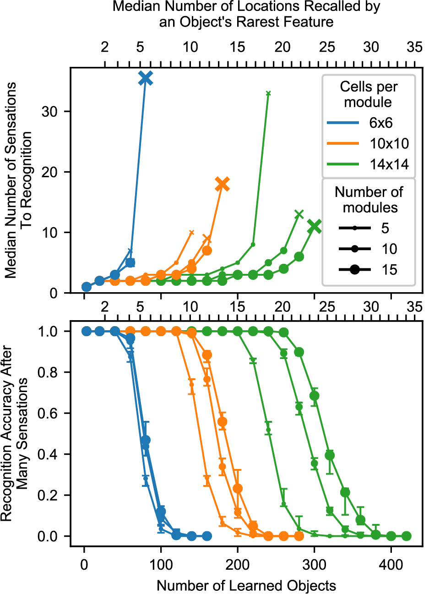
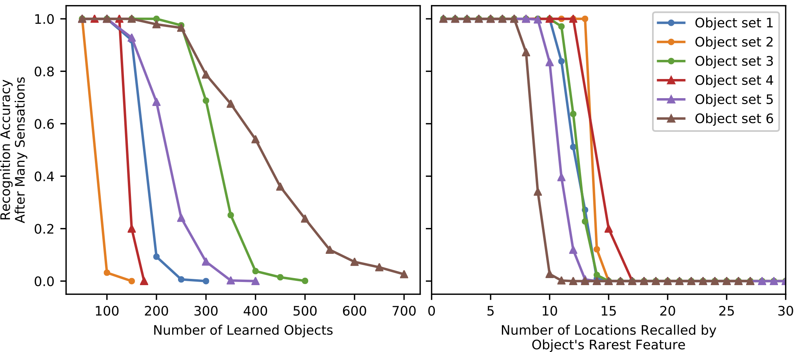

# Locations in the Neocortex: A Theory of Sensorimotor Object Recognition Using Cortical Grid Cells

Below are instructions for reproducing the charts and data-driven figures in the paper.

## Prerequisites

1.  Installing HTM Research Library

All the scripts in this directory depend on Numenta's [htmresearch library](https://github.com/numenta/htmresearch) that runs on Python 2.7. See the library's Github repository for installation instructions.

2. Running in Docker

There is an included Dockerfile that can be built. It will include the scripts in this directoy that can be run inside the container as follows:

    docker build -t IMAGE_NAME .
    docker run IMAGE_NAME COMMAND

"IMAGE_NAME" may be whatever you want. "COMMAND" will be one of the shell
script commands listed below. The resulting charts will be saved to the
`charts` directory (outside the container).

## Figures 5A, 5B, and 6A

Generate with:

    ./runGaussian_narrowing.sh

**Figure 5.** As the network recognizes an object, it converges onto
a sparse activation.

**Figure 5. (A)** Location layer cell activity in three (out
of ten) grid cell modules while recognizing a single object. The
bumps of activity are shown in color; red indicates a high firing
rate. The location representation, shown as darkened circles,
consists of cells that are sufficiently active. Each movement
shifts the activity and each sensation narrows the activity to the
cells that predict the new sensation. Cell activity converges onto
a sparse representation by Sensation 3 and remains sparse
afterward.

**Figure 5 (B)** Cell activity in the same three modules as (A),
shown for additional sensations and for two additional objects.
Each module has 100 cells. The black lines indicate that the cell
is active during the indicated sensation. After the first sensation,
the location codes are very ambiguous in all cases. Depending on
how common the sensed features are, the module activity
narrows at different rates for the different objects. The sensation
highlighted in red shows the first step in which the object is
unambiguously determined. From this point on, the module
activity shifts with each movement but remains unique to the
object being sensed. (These simulations used a unique feature
pool of size 40.)

**Figure 6. (A)** With multiple sensations, the location layer activity converges to a sparse representation. Using the same simulation
from Figure 5, we show the activation density after each sensation, averaged across all objects and modules. With additional
sensations, the representation becomes sparser until the object is unambiguously recognized. With more learned objects, the network
takes longer to disambiguate. The activation density of the first sensation increases with the number of learned objects. If the initial
activation density is low, the network converges very quickly. If it's high, convergence can take longer.

## Figure 6B

Generate with:

    ./runGaussian_comparisonToIdeal.sh

**Figure 6. (B)** Comparison of this network’s performance with the ideal
observer and a bag-of-features detector. Each model learned 100 objects from a
unique feature pool of size 10. We show the percentage of objects that have
been uniquely identified after each sensation, averaged across all objects
for ten separate trials. The ideal model compares the sequence of input
features and locations to all learned objects while the bag-of-features model
ignores locations. With a sufficiently large number of cells per module, the
proposed neural algorithm gets similar results to the ideal computational
algorithm.

## Figure 7 A-C

Generate with:

    ./runGaussian_capacityTrends.sh

**Figure 7. (A-C)** Model capacity changes with model parameters
(blue) and object parameters (orange). The network's capacity is
the maximum number of objects that it can learn while
maintaining the ability to uniquely identify at least 90% of the
objects. **(A)** Increasing the number of modules in the network
increases capacity sublinearly, and this impact depends on the
dendritic threshold of the neurons reading this location
representation. The two lines show two different thresholds
relative to *n*, the number of modules. With only one module the
network can successfully converge to one location, but that
location isn't object-specific (red 'x'). **(B)** Increasing the number
of cells increases capacity linearly. **(C)** Similarly, increasing the
feature pool size also increases capacity linearly.

## Figure 7D

Generate with:

    ./runGaussian_capacityHeatmap.sh

**Figure 7. (D)** A heatmap
showing the capacity of the network while varying the feature
pool size and location module size. An increase in the number of
cells per module can compensate for a decrease in the number of
unique features.

## Figure 8

Generate with:

    runGaussian_summary.sh

**Figure 8.** Summary chart showing recognition time and capacity
while varying the model parameters. The top chart shows the
median number of sensations required to recognize an object,
and it marks the final point where a network recognized at least
50% of objects using an 'x'. The bottom chart shows the
percentage of objects that were recognized after traversing every
point on the object multiple times. The charts share an x axis,
and this x axis has two sets of ticks and labels. The bottom ticks
are numbers of learned objects, given 10 locations per object and
100 unique features. The top ticks are the typical smallest union
sizes that will be invoked by each object. With different
statistics, these curves will shift relative to the bottom ticks, but
they should stay approximately fixed relative to the top ticks.

## Figure S1

Generate with:

    runGaussian_featureDistributions.sh

**Figure S1.** Varying the object statistics, the model's breaking point varies significantly relative to number of learned objects. The
breaking point is much more consistent relative to the number of locations recalled by object features. In these charts we use a single
model and test on 6 different distributions of objects. The model uses 10 modules with 10x10 cells per module. **(Left)** The network’s
capacity depends on the statistics of objects. The network's performance begins to break down after a certain number of objects, and
this breaking point can vary by orders of magnitude with different object distributions. **(Right)** This breaking point varies significantly
less when described in terms of "number of locations recalled by a sensation" rather than "number of objects learned." Using the same
data from the first chart, for each object we measure the total number of occurrences of the object's rarest feature, and we plot
recognition accuracy against this number. With each of these object distributions, the model reaches its breaking point when the
number of recalled locations is within a small interval – conservatively, between 7 and 15. There is still some variation due to the
statistics of the object's other features (not just its rarest feature), but the number of occurrences of the rarest feature provides a good
first approximation for whether the network will recognize the object. **(Object descriptions)** Each object set had 100 unique features
and 10 features per object, except where otherwise noted. The first three sets generate objects using the same strategy as all the other
simulations, varying the parameters. The last three use different strategies. Object Set 1: baseline. Object Set 2: 40 unique features
rather than 100. Object Set 3: 5 features per object rather than 10. Object Set 4: Every feature occurs the same number of times, +/- 1,
rather than each object being randomly selected set of features with replacement. Object Set 5: Bimodal distribution of features,
probabilistic. Divide features into two equal-sized pools, choose features from the second pool more often than features from the first.
Object Set 6: Bimodal distribution of features, enforced structure. The features are divided equally into pools. Each object consists of
one feature from the first pool and nine from the second.
