# Unsupervised Real-Time Anomaly Detection for Streaming Data, Neurocomputing Volume 262, 1 November 2017, Pages 134-147.<br>[doi:10.1016/j.neucom.2017.04.070][1]

Installing NAB
--------------
All the figures in this paper were generated using [NAB][2] version 1.0. NAB is written in python and it requires [python 2.7][3] to be installed on your system.

To install [NAB][2] and its dependencies, use the following command:

```
git clone https://github.com/numenta/NAB.git
cd NAB
git checkout v1.0
pip install -e .
```


Generating figures
------------------

NAB will install a command line tool called `nab-plot` that can be used to plot specific charts. We will use this tool to generate most of the figures.

```
usage: nab-plot [-h] [--value {value,raw,likelihood}] [--start START]
                [--end END] [--labels] [--no-labels] [--windows] [--probation]
                [--title TITLE] [--xLabel XLABEL] [--no-xLabel]
                [--yLabel YLABEL] [--fontSize FONTSIZE] [--width WIDTH]
                [--height HEIGHT] [--offline] [--output OUTPUT]
                file
```

### Figure 1: Real-world temperature sensor data from an internal component of a large industrial machine

The figure shows real-world temperature sensor data from an internal component of a large industrial machine. Anomalies are labeled with circles. The first anomaly was a planned shutdown. The third anomaly was a catastrophic system failure. The second anomaly, a subtle but observable change in the behavior, indicated the actual onset of the problem that led to the eventual system failure. The anomalies were hand-labeled by an engineer working on the machine. This file is included in the [Numenta Anomaly Benchmark corpus][2]
```
nab-plot realKnownCause/machine_temperature_system_failure.csv --offline --no-xLabel --yLabel="Temperature" --start="2013-12-11 06:10:00"
```
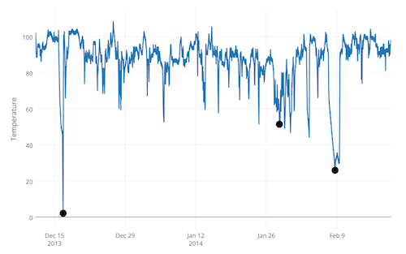

### Figure 2: CPU utilization (percent) for an Amazon EC2 instance

CPU utilization (percent) for an Amazon EC2 instance (data from the [Numenta Anomaly Benchmark][2]). A modification to the software running on the machine caused the CPU usage to change. The initial anomaly represents a changepoint, and the new system behavior that follows is an example of concept drift. Continuous learning is essential for performing anomaly detection on streaming data like this.
```
nab-plot realAWSCloudwatch/ec2_cpu_utilization_5f5533.csv --offline --no-xLabel --yLabel="CPU Utilization (Percent)" --start="2014-02-23 00:00:00" --end="2014-02-25 23:59:59"
```
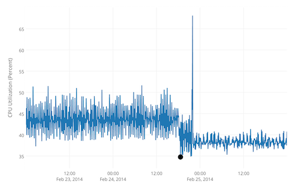


### Figure 5: An example stream along with prediction error

**Fig 5a**. This plot shows CPU usage on a database server over time. There are two unusual behaviors in this stream, the temporary spike up to 75% and the sustained shift up to 30% usage
```
nab-plot realAWSCloudwatch/rds_cpu_utilization_e47b3b.csv --offline --no-xLabel --yLabel="CPU Utilization (Percent)" --fontSize=14 --width=1000 --height=400
```
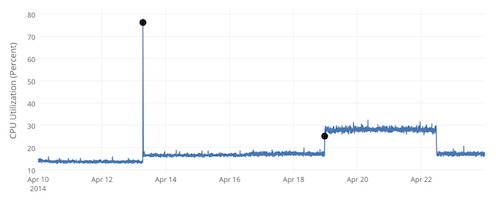

**Fig 5b**. This plot shows the prediction error while the HTM trains on this stream. Early during training the prediction error is high while the HTM model learns the data. There is a spike in prediction error corresponding to the temporary spike in CPU usage that quickly drops once usage goes back near normal. Finally there is an increase in prediction error corresponding to the sustained shift, which drops after the HTM has learned the new behavior.
```
nab-plot realAWSCloudwatch/rds_cpu_utilization_e47b3b.csv --offline --no-xLabel --value="raw" --fontSize=14 --width=1000 --height=400
```
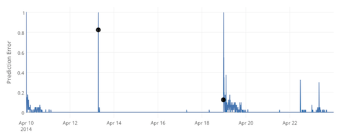


### Figure 6: A very noisy, unpredictable stream.

**Fig 6a**. The data shows the latency (in seconds) of a load balancer on a production website. The anomaly (indicated by the dot) is an unusual sustained increase in latencies around April 10.
```
nab-plot artificialWithAnomaly/art_load_balancer_spikes.csv --offline --no-xLabel --yLabel="Latency" --fontSize=16 --width=1000 --height=300
```
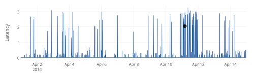

**Fig 6b**. The prediction error from an HTM model on the latency values. The unpredictable nature of the latencies results in frequent spikes in the prediction error that cannot be distinguished from the true positives. The fact that the unpredictable metric values are spikes and the rest of the latencies are close to zero results in the coincidental similarity between the latencies and resulting prediction error.
```
nab-plot artificialWithAnomaly/art_load_balancer_spikes.csv --offline --no-xLabel --value="raw" --fontSize=16 --width=1000 --height=300
```
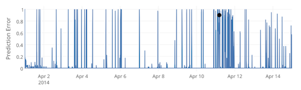

**Fig 6c**. A log-scale plot of the anomaly likelihood computed from the prediction error. Unlike the prediction error plot, there is a clear peak right around the real anomaly.
```
nab-plot artificialWithAnomaly/art_load_balancer_spikes.csv --offline --no-xLabel --value="likelihood" --fontSize=16 --width=1000 --height=300
```
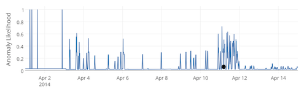


### Figure 7: Several data streams from the NAB corpus, showing a variety of data source and characteristics

**Fig 7a**. Click-through prices for online advertisements
```
nab-plot realAdExchange/exchange-4_cpc_results.csv --offline --no-xLabel --yLabel="Cost Per Click" --fontSize=24
```
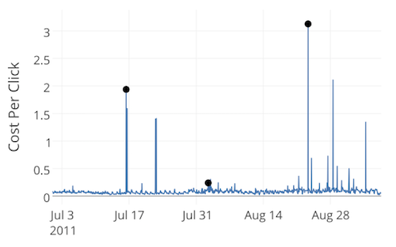

**Fig 7b**. An artificial stream with some noise but no anomalies
```
nab-plot artificialNoAnomaly/art_daily_small_noise.csv --offline --no-xLabel --yLabel="Metric" --fontSize=24
```
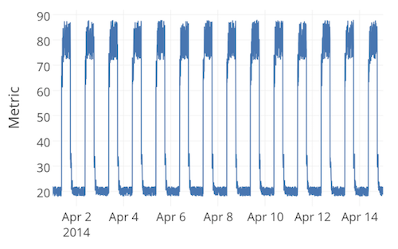

**Fig 7c**. AWS Cloudwatch CPU utilization data
```
nab-plot realAWSCloudwatch/ec2_cpu_utilization_fe7f93.csv --offline --no-xLabel --yLabel="CPU Utilization (Percent)" --fontSize=24
```
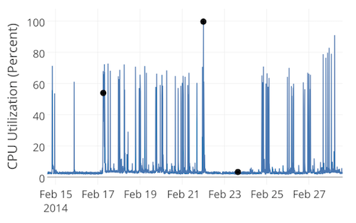

**Fig 7d**. Autoscaling group data for a server cluster
```
nab-plot realAWSCloudwatch/grok_asg_anomaly.csv --offline --no-xLabel --yLabel="Autoscaling Group Size" --fontSize=24
```
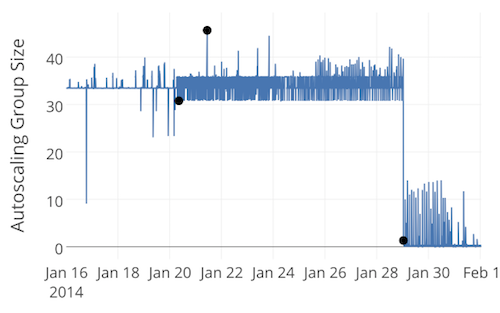

**Fig 7e**. A stream of tweet volumes related to FB stock
```
nab-plot realTweets/Twitter_volume_FB.csv --offline --no-xLabel --yLabel="Tweets Referencing Facebook" --fontSize=24
```
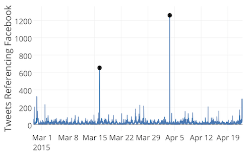

**Fig 7f**. Hourly demand for New York City taxis
```
nab-plot realKnownCause/nyc_taxi.csv --offline --no-xLabel --yLabel="NYC Taxi Demand" --fontSize=24
```
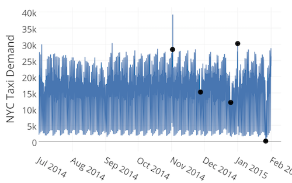


### Figure 8: A zoomed in view showing the anomaly window around the first anomaly in Fig. 1.

A zoomed in view showing the anomaly window around the first anomaly in Fig. 1. The window size is set large enough to reward early detections of the anomaly, yet small enough such that poor detections count as false positives.
```
nab-plot realKnownCause/machine_temperature_system_failure.csv --offline --no-xLabel --yLabel="Temperature" --windows --start="2013-12-13 05:20:00" --end="2013-12-20 08:50:00"
```
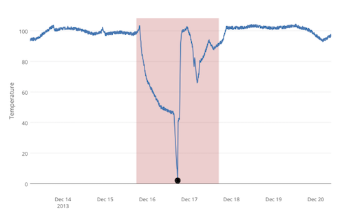


### Figure 9: Detector results for two example NAB data streams

These plots show detector results for two example NAB data streams. In both cases we show a subset of the full data stream. The plotted shapes correspond to the detections of seven different detectors: HTM, Multinomial Relative Entropy, Twitter ADVec, Skyline, Sliding Threshold, Bayesian Online Changepoint, and EXPoSE. Shapes that correspond to the same data point have been spaced vertically for clarity. For a given detector, true positive detections within each window (red shaded regions) are labeled in black. All false positive detections are colored red. (a) Detection results for a production server's CPU metric. The second anomaly shows a sustained shift that requires algorithms to adjust to a new normal behavior. (b) Results for the data stream shown in Fig. 2. Here we see a subtle temporal anomaly that preceded a large, obvious spike in the data. (For interpretation of the references to colour in this figure legend, the reader is referred to the web version of this article.)

```
python fig9.py
```

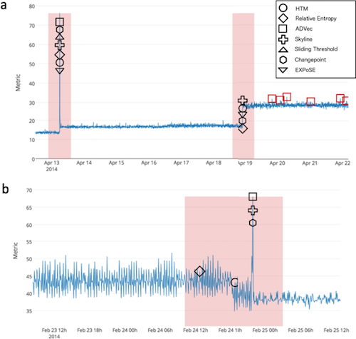


[1]: https://doi.org/10.1016/j.neucom.2017.04.070
[2]: https://github.com/numenta/NAB/tree/v1.0
[3]: https://www.python.org/downloads
